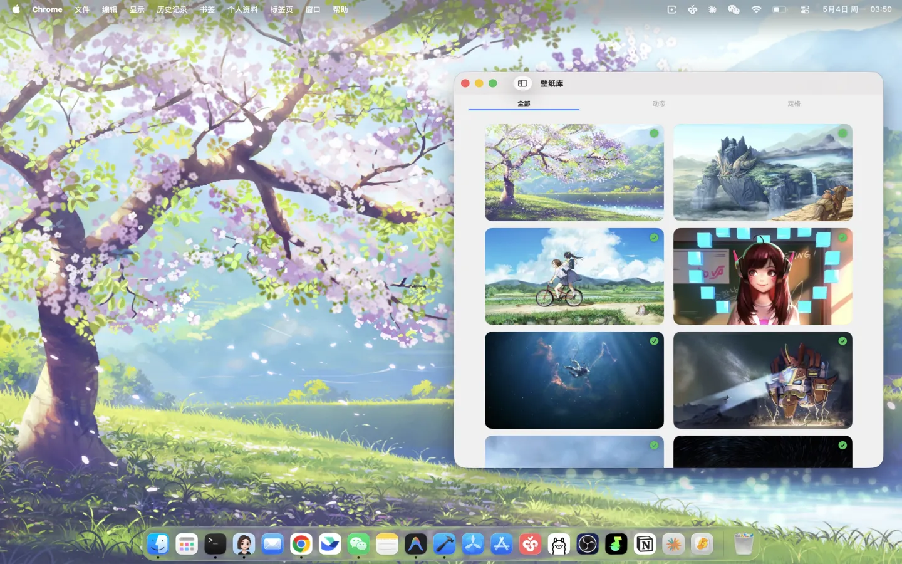
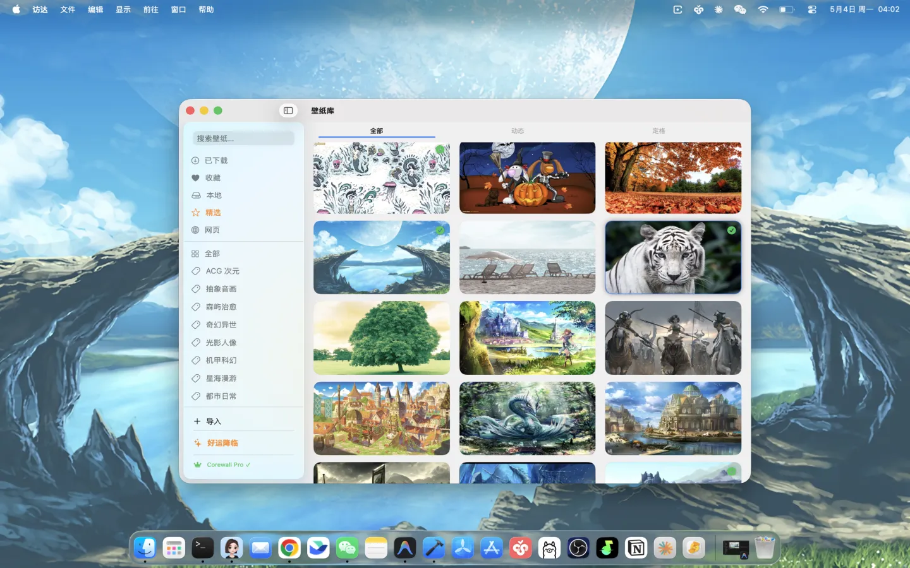
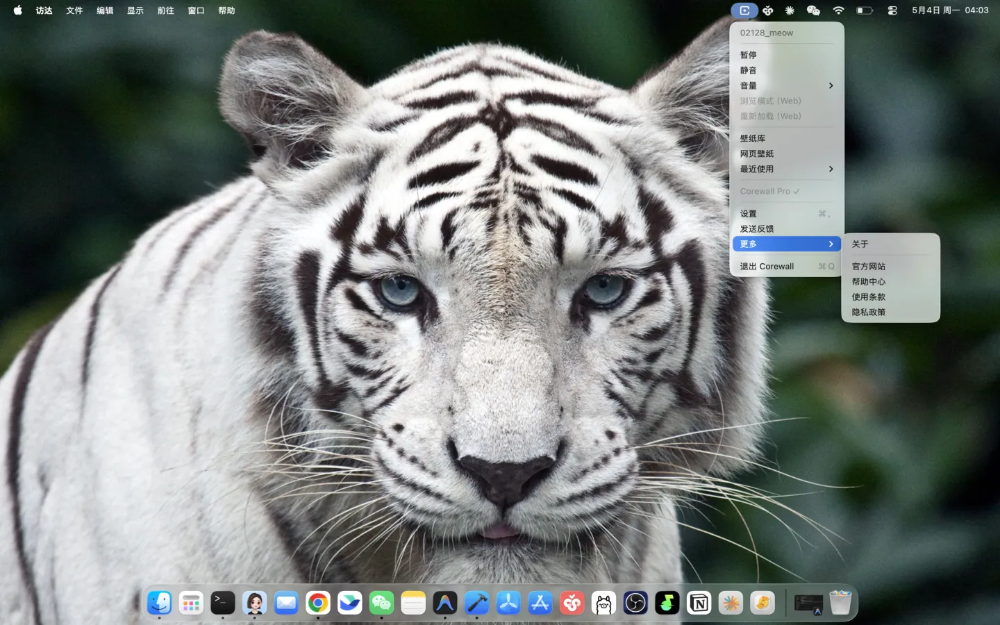
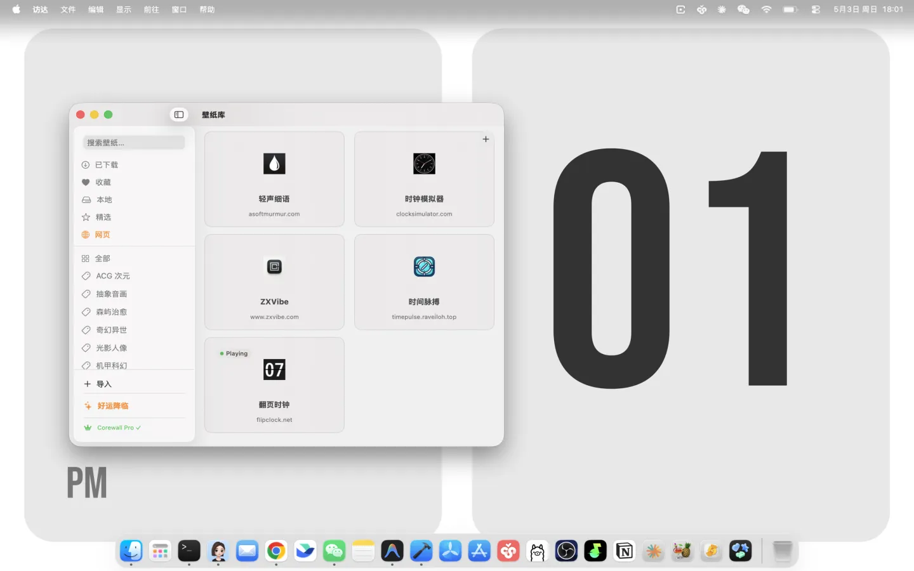
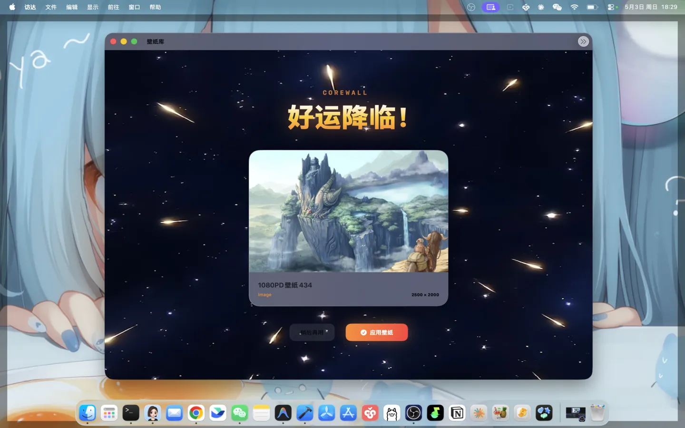

  <h1>Corewall</h1>
  
<b>macOS 沉浸式桌面体验 — 网页、视频、白噪音，想放什么放什么</b>

   

  
  
  
  

  如果 Corewall 对你有用，请给个 ⭐ Star — 这是对独立开发者最大的鼓励！

  <a href="https://zxvibe.com" target="_blank" rel="noopener noreferrer">官网</a> · <a href="https://apps.apple.com/app/id6762517792?mt=12" target="_blank" rel="noopener noreferrer">App Store</a> (搜索 **Corewall**) · <a href="https://testflight.apple.com/join/8hBCbycu" target="_blank" rel="noopener noreferrer">TestFlight</a>

---

## Preview

  
  

  
  

  

---

## About

**Corewall** 是一个 macOS 原生的沉浸式桌面应用。把网页、视频、白噪音放到桌面上，让你的 Mac 不只是工具，而是一个有温度的沉浸空间。

一个人开发，从设计到上架全自己来。

## Highlights

### 1. 网页桌面 — 粘个网址，桌面就是网页

支持 WebGL、Canvas 和 3D 交互式网页。内置白噪音、时间等精选网址，后台可随时添加新内容。

### 2. 视频桌面 — 4K 视频铺满桌面，带声音

基于 AVFoundation 优化的渲染引擎，极低 CPU 占用，不会让电脑发热。

| 普通壁纸 | Corewall |
|---------|----------|
| 静态图片 | 4K 视频 + 声音 |
| 纯装饰 | 白噪音/天气/日历 |
| 无交互 | 可交互网页 |

### 3. Lucky Drop — 盲盒开箱，惊喜抽取

不仅仅是随机，更是一种惊喜与好运。每次切换都有新发现。

### 4. 精选图库 — 海量图片，不喜欢就去掉

ACG、赛博朋克、自然风景等分类。不喜欢可以直接去掉，不会再出现。

### 5. 本地导入

自己的视频和图片也能用。选择文件夹导入，快速设置。

## Quick Start

1. **下载** — 前往 <a href="https://apps.apple.com/app/id6762517792?mt=12" target="_blank" rel="noopener noreferrer">App Store</a> 下载 Corewall
   - *注：若跳转失败，请使用 <a href="https://apps.apple.com/cn/app/corewall/id6762517792?mt=12" target="_blank" rel="noopener noreferrer">中国区直接链接</a> 或在 App Store 搜索 **Corewall***
2. **打开** — Corewall 以菜单栏应用运行，在状态栏中找到图标
3. **选择** — 从图库挑选，或粘贴一个网址，桌面立刻变样

想体验最新版本？加入 [TestFlight 公开测试](https://testflight.apple.com/join/8hBCbycu)。

## Design Philosophy

- **沉浸优先** — 桌面不只是背景，而是你每天面对的沉浸空间
- **轻量无感** — 极低 CPU 占用，电池保护，热量管理，不影响工作
- **本地优先** — 所有数据本地处理，不收集任何个人信息
- **持续进化** — 图库和网页内容从后台管理，随时添加新内容

## Use Cases

- **专注工作** — 白噪音桌面，帮你进入心流
- **放松休息** — 雨声、壁炉、自然风景，舒缓一整天的疲惫
- **个性表达** — 自己的视频和图片，桌面就是你的画布
- **惊喜探索** — Lucky Drop 扭蛋，每次开箱都有新鲜感

## System Requirements

- macOS 14.0 (Sonoma) 或更高版本
- Apple Silicon / Intel 均支持

## Privacy

Corewall 不收集任何个人数据。所有处理、渲染和配置存储均在本地完成。详见 [隐私政策](https://www.zxvibe.com/privacy.html)。

## Resources

- **Website**: <a href="https://zxvibe.com" target="_blank" rel="noopener noreferrer">zxvibe.com</a>
- **App Store**: <a href="https://apps.apple.com/app/id6762517792?mt=12" target="_blank" rel="noopener noreferrer">Corewall</a> (或在 App Store 搜索 **Corewall**)
- **TestFlight**: <a href="https://testflight.apple.com/join/8hBCbycu" target="_blank" rel="noopener noreferrer">公开测试</a>
- **Privacy Policy**: <a href="https://www.zxvibe.com/privacy.html" target="_blank" rel="noopener noreferrer">zxvibe.com/privacy.html</a>

## Contact

- **GitHub**: [sumachuyuan/corewall](https://github.com/sumachuyuan/corewall)
- **Issues**: [GitHub Issues](https://github.com/sumachuyuan/corewall/issues)
- **Email**: [tidilist@gmail.com](mailto:tidilist@gmail.com)

## Acknowledgements

Corewall 的早期灵感来自 [Plash](https://github.com/sindresorhus/Plash)，感谢 Sindre Sorhus 及所有 Plash 贡献者。Corewall 使用了以下开源组件：[Defaults](https://github.com/sindresorhus/Defaults)、[LaunchAtLogin-Modern](https://github.com/sindresorhus/LaunchAtLogin-Modern)、[KeyboardShortcuts](https://github.com/sindresorhus/KeyboardShortcuts)。

## License

Copyright © 2026 Corewall Team. All rights reserved.
